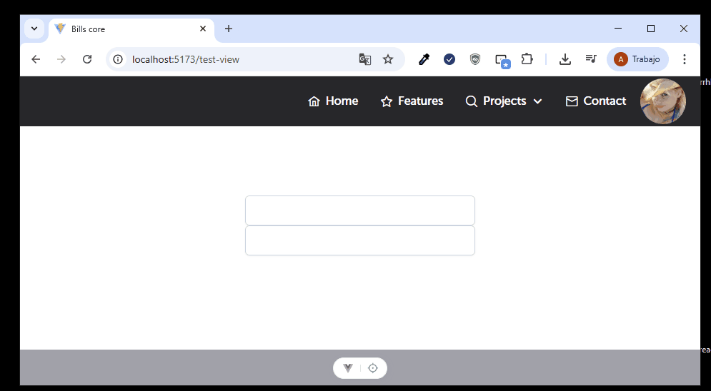

El componente AppAlert se puede utilizar de la siguiente manera:

Tomar en cuenta que este componente ya se encuentra anclado en el app global, lo único
que debemos manejar es el estado ligado al funcionamiento de este componente y pasar los argumentos según la
necesidad del caso.

El estado de la alerta se encuentra en useAlertStore.ts (src/core/store/useAlertStore), el cual cuenta 
con la acción de showAlert ligado al estado message este recibe un objeto compuesto de la siguiente manera

```
  show?: boolean;
  type?: 'success' | 'success' | 'info' | 'warning' | 'error';
  icon?: string;
  title?: string;
  content?: string;
  closable?: boolean;
  maxWith?: number;
  timeout?: number;
  ```

  En ese sentido, usted debe usarlo así por ejemplo:

  ```
  import { useAlertStore } from 'src/core/store/useAlertStore';

  const alert = useAlertStore();

  alert.showAlert({
    show: true,
    type: "success",
    title: "Este es el título",
    content: "Esta es la información del contenido",
    closable: true,
    timeout: 2000 //esta propiedad es un valor de milisegundos
  })
  ```

  Resultado:

  