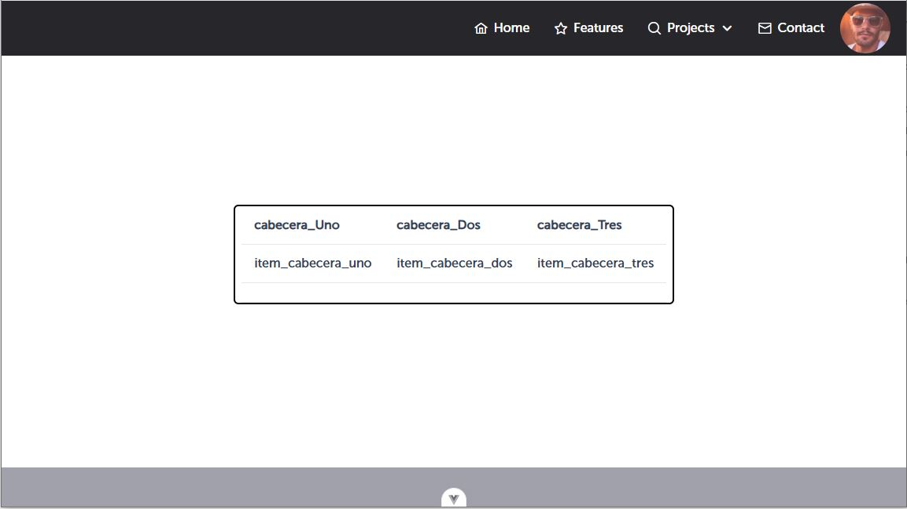
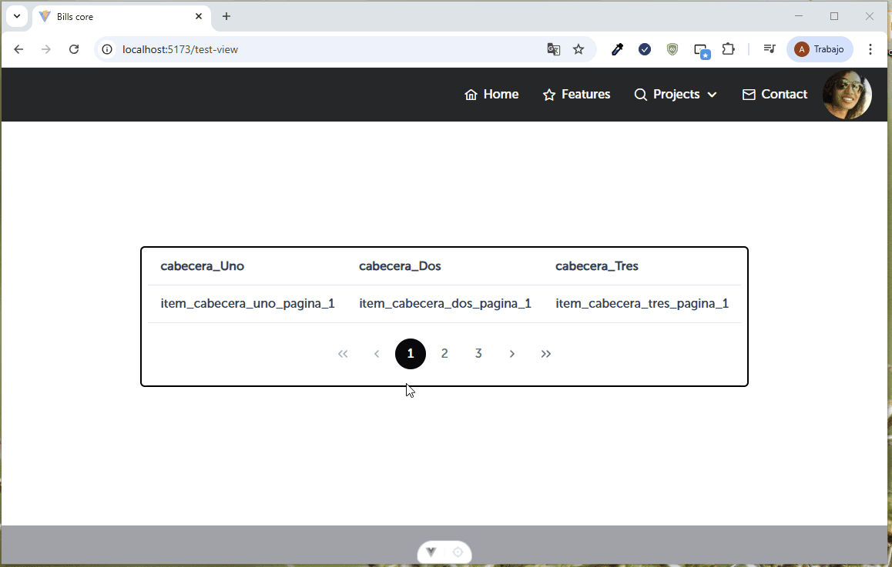
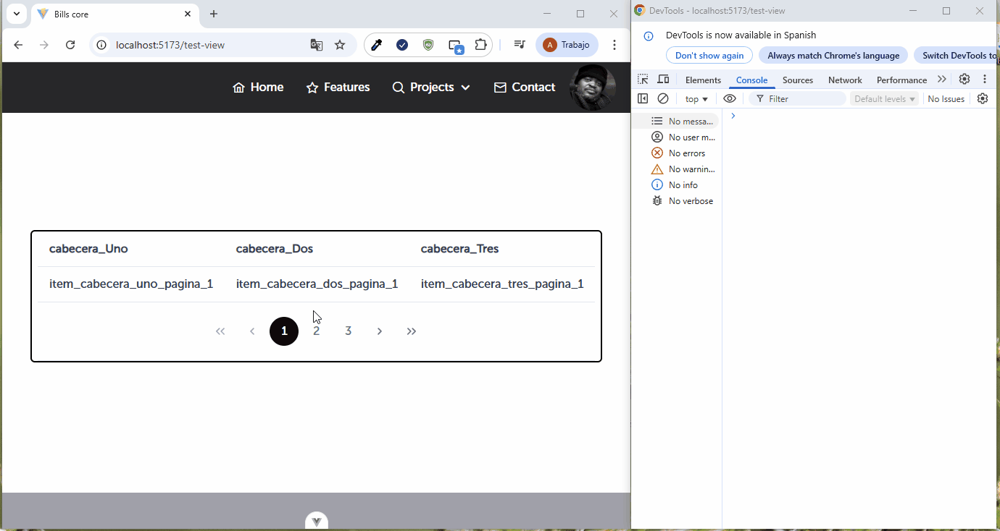

El componente reutilizable de AppDataTable puede utilizarse de la siguiente manera

y cuenta con la siguientes propiedades básicas a tomar en cuenta:

| Propiedad | Tipo | Valor por defecto | Descripción |
| --------- | ---- | ----------------- | ----------- |
| headers   | Array|        []         | Valor que recibiran las cabeceras de la tabla, este debera contar con un arreglo de objetos debidamente tipado [] |
| items | Array | T[] | Valor que recibiran cada uno de los items que estaran ligados a las cabeceras |
| per_page | Number | 1 |Valor que determinara cuantos elementos recibira por página |
| total_pages | Number | 0 | Valor que determina el total de pagina que contiene la tabla |
| loading | Boolean | false | Bandera que sirve para activar o desactivar la animación de carga de la tabla |
| loadingIcon | String | "pi pi-spin pi-spinner" | Valor que nos permite mostrar el icono cuando 'loading' se encuentra en true|
| rowHover | Boolean | true | Bandera que permite activar/desactivar la animación de hover sobre las filas de la tabla|
| paginator | Boolean | false | Bandera que permite activar/desactivar el componente de paginación que se visualiza en el pie de la tabla siempre y cuando este se encuentre en paginator = true | 

Si usted útiliza un v-bind="attrs", heredará las propiedades del componente base de PrimeVue 4, en ese sentido, para ampliar que otras propiedades puede integrar en la tabla, puede visitar la página oficial de PrimeVue https://primevue.org/datatable/


A continuación se muestra como puede implementar/utilizar el componente en mención:

```
<template>
 <AppDataTable :headers="headers" :items="items"> </AppDataTable>
</template>
<script setup lang="ts">
import AppDataTable from "src/core/components/AppDataTable.vue";
import type { TableHeaders } from 'src/core/interfaces/datatable.interface';
import { ref } from 'vue';

const headers = ref<TableHeaders[]>([
  {
    field: 'vinculador_uno', // ---> corresponde al vinculador del item que recibira en su columna respectiva
    header: 'cabecera_Uno',  //---> corresponde al nombre de la cabecera de la columna
    sortable: false, // ---> si usted require que la columna sea sorteable 
    alignHeaders: 'center', // ---> alineación de la cabecera, puede tener valores 'start', 'center' o 'end'
    alignItems: 'center', // ---> alineación de los items bajo esa cabecera ('start', 'center', 'end')
  },
  {
    field: 'vinculador_dos',
    header: 'cabecera_Dos',
    sortable: false,
    alignHeaders: 'center',
    alignItems: 'center',
  },
  {
    field: 'vinculador_tres',
    header: 'cabecera_Tres',
    sortable: false,
    alignHeaders: 'center',
    alignItems: 'center',
  },
]);


//El arreglo debe estar compuesto de esta manera donde el nombre de cada una de la propiedad debe coincidir 
con cada una de los "field" de las cabeceras.

const items = ref([
  {
    vinculador_uno: 'item_cabecera_uno', 
    vinculador_dos: 'item_cabecera_dos',
    vinculador_tres: 'item_cabecera_tres',
  },
]);

</script>

```




También podemos agregar el paginador para manejar datos paginados.

```
<template>
 <AppDataTable
    :headers="headers"
    :items="items"
    :paginator="true" // --> activa el paginador
    :per_page="1" // --> indica la cantidad de items/filas por página
    :total_pages="3" // --> indica el total de páginas
  >
  </AppDataTable>
</template>
<script setup lang="ts">
import AppDataTable from "src/core/components/AppDataTable.vue";
import type { TableHeaders } from 'src/core/interfaces/datatable.interface';
import { ref } from 'vue';

const headers = ref<TableHeaders[]>([
  {
    field: 'vinculador_uno', 
    header: 'cabecera_Uno',  
    sortable: false, 
    alignHeaders: 'center', 
    alignItems: 'center',
  },
  {
    field: 'vinculador_dos',
    header: 'cabecera_Dos',
    sortable: false,
    alignHeaders: 'center',
    alignItems: 'center',
  },
  {
    field: 'vinculador_tres',
    header: 'cabecera_Tres',
    sortable: false,
    alignHeaders: 'center',
    alignItems: 'center',
  },
]);

const items = ref([
  {
    vinculador_uno: 'item_cabecera_uno_pagina_1',
    vinculador_dos: 'item_cabecera_dos_pagina_1',
    vinculador_tres: 'item_cabecera_tres_pagina_1',
  },
  {
    vinculador_uno: 'item_cabecera_uno_pagina_2',
    vinculador_dos: 'item_cabecera_dos_pagina_2',
    vinculador_tres: 'item_cabecera_tres_pagina_2',
  },
  {
    vinculador_uno: 'item_cabecera_uno_pagina_3',
    vinculador_dos: 'item_cabecera_dos_pagina_3',
    vinculador_tres: 'item_cabecera_tres_pagina_3',
  },
]);

</script>

```



Generalmente cuando usted utiliza paginación consumira enpoints, en ese sentido necesitara escuchar el cambio
de la pagina siguiente, por lo que puede utilizar el evento que emite el componente.

Tomar en cuenta que este evento es en base al componente de PrimeVue, en ese sentido, el orden de posiciones de paginación inicia desde el "0" en delante.

```
@page-update o @pageUpdate con el cual le retornará el numero de la página a la cual hizo click

<template>
<AppDataTable
    :headers="headers"
    :items="items"
    :paginator="true" // --> activa el paginador
    :per_page="1" // --> indica la cantidad de items/filas por página
    :total_pages="3" // --> indica el total de páginas
    @update-page="pagina"
  >
  </AppDataTable>
</template>
<script setup lang="ts">
const pagina = (item) => {
    console.log(item, "página");
}
</script>


```


