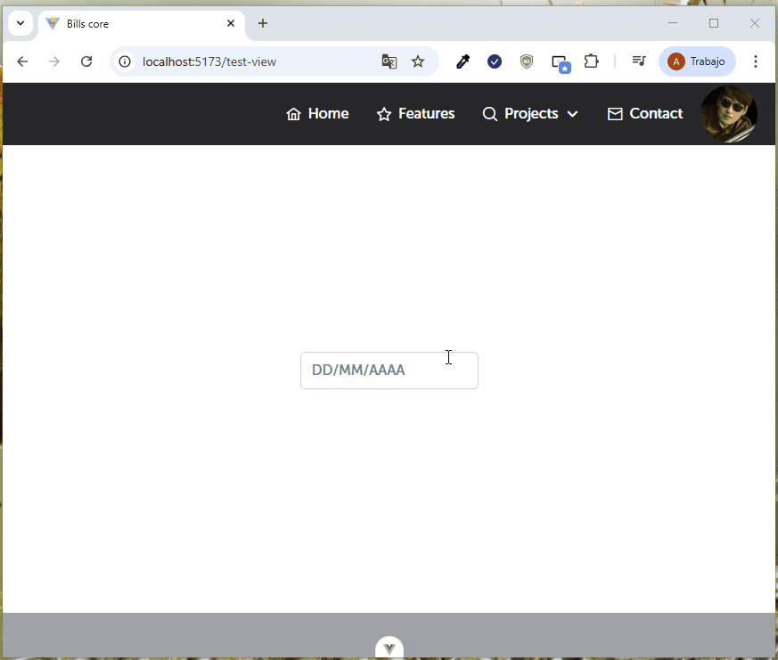

El componente AppDatePicker nos servira para la selección de fechas:

| Propiedad       | Tipo      | Valor por defecto  | Descripción                                                                 |
|----------------|-----------|--------------------|-----------------------------------------------------------------------------|
| icon           | String    | 'pi pi-calendar'   | Icono de calendario que se mostrará en el componente.                      |
| selectionMode  | String    | 'single'           | Modo de selección de fechas: puede ser 'single', 'multiple' o 'range'.     |
| showOtherMonths| Boolean   | true               | Muestra los días de otros meses en la cuadrícula del calendario.           |
| minDate        | Date      | null               | Fecha mínima seleccionable.                                                |
| maxDate        | Date      | null               | Fecha máxima seleccionable.                                                |
| disabledDates  | Date[]    | []                 | Arreglo de fechas deshabilitadas.                                          |
| disabledDays   | number[]  | null               | Días de la semana deshabilitados (0=Domingo, 6=Sábado).                    |
| disabled       | Boolean   | false              | Desactiva completamente el componente.                                     |
| readonly       | Boolean   | false              | Modo de solo lectura, no permite seleccionar nuevas fechas.                |
| placeholder    | String    | 'DD/MM/AAAA'       | Texto de marcador de posición cuando no hay una fecha seleccionada.        |
| iconDisplay    | String    | ''                 | Posición del icono (por ejemplo, 'input' o 'button').                      |
| showTime       | Boolean   | false              | Si se debe mostrar la selección de hora junto con la fecha.                |

Si usted útiliza un v-bind=“attrs”, heredará las propiedades del componente base de PrimeVue 4, en ese sentido, para ampliar que otras propiedades puede integrar en la tabla, puede visitar la página oficial de PrimeVue https://primevue.org/datepicker

