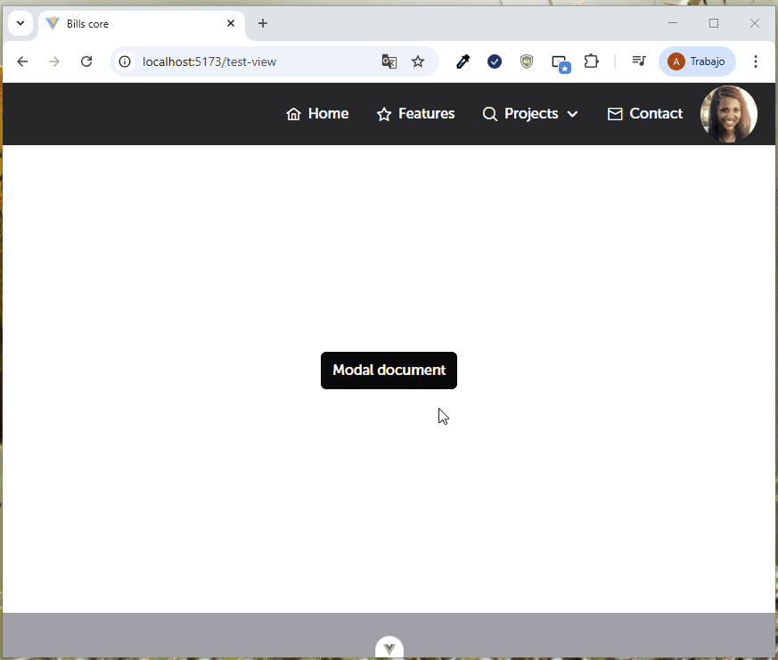

Este componente nos permitira mostrar documentos multimedia a través de un modal.

| Propiedad           | Tipo     | Valor por defecto     | Descripción                                                                 |
|---------------------|----------|------------------------|-----------------------------------------------------------------------------|
| documentName        | String   | ''                     | Nombre del documento que se mostrará o utilizará como referencia.           |
| file                | String   | ''                     | Ruta o base64 del archivo que se desea mostrar o procesar.                  |
| show                | Boolean  | false                  | Determina si el documento debe mostrarse o no.                              |
| validType           | String   | 'application/pdf'      | Tipo MIME válido del archivo, por defecto es PDF.                           |
| stylesShowDocument  | Boolean  | true                   | Si se aplican estilos personalizados al mostrar el documento.               |


Puede utilizar de esta manera:

```
<template>
  <Button @click="openModal(show)">Modal document</Button>
  <AppDocumentVisor
    :document-name="'prueba'"
    :show="show"
    :file="documento"
    :validType="'application/pdf'"
    @close-visor="closeModal"
  />
</template>
<script setup lang="ts">
import { ref } from 'vue';
import { Button } from 'primevue';

const show = ref<boolean>(false);

const openModal = (value: boolean) => {
  show.value = !value;
};
const documento = ref(
  'data:application/pdf;base64,'aca debe ir la cadena base 64',
);

const closeModal = (value: boolean) => {
  show.value = value;
};
</script>

```



