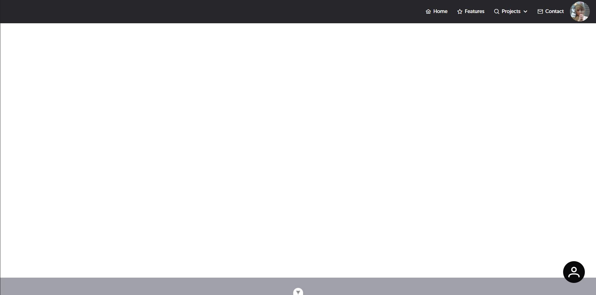

El componente AppFloatButton  generamelmente se utiliza para vincularlo a redes sociales o contactos directos,

| Propiedad         | Tipo   | Valor por defecto | Descripción                                                  |
| ----------------- | ------ | ----------------- | ------------------------------------------------------------ |
| multimedia_source | String | -                 | Fuente multimedia (URL, base64, etc.) que se desea utilizar. |
| icon              | String | ''                | Nombre del icono que se mostrará en el componente.           |
| class             | String | -                 | Clases CSS personalizadas para aplicar al componente.        |


```
<template>
<AppFloatButton @event-click="clickFloatButton" icon="pi pi-phone" />
</template>
<script setup lang="ts">
    const clickFloatButton = () => console.log("Has hecho click!!!")
</script>
```
visualizaremos algo similar a esto, cabe mencionar, que por defecto el componente flotante se va a desplazar hasta la esquina inferior derecha.

;