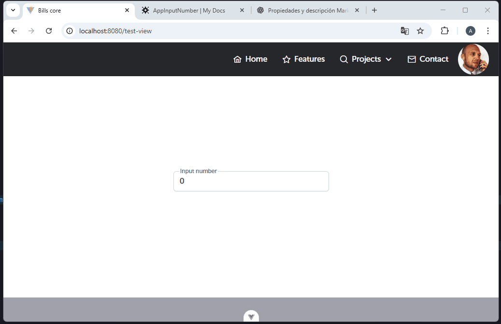

El componente en referencia se encuentra ya configurado para poder reutilizarlo, de esta manera, estas serían las propiedades que corresponden a dicho componente:

| Propiedad        | Tipo    | Valor por defecto | Descripción                                                                                                |
| ---------------- | ------- | ----------------- | ---------------------------------------------------------------------------------------------------------- |
| class            | String  | 'w-full'          | Clases CSS aplicadas al componente.                                                                        |
| placeholder      | String  | ''                | Texto de marcador de posición dentro del input.                                                            |
| severity         | String  | 'error'           | Severidad del mensaje de error o validación (por ejemplo, 'error', 'info').                                |
| size             | String  | 'small'           | Tamaño del mensaje de error que se muestra por debajo del input (por ejemplo, 'small', 'medium', 'large'). |
| variant          | String  | 'simple'          | Variante visual del mensaje de error (por ejemplo, 'simple', 'outlined', etc.).                            |
| labelVariant     | String  | 'on'              | Corresponde al tipo de variante del label flotante.                                                        |
| inputVariant     | String  | 'large'           | Corresponde a la variante visual del campo de entrada.                                                     |
| errorMessages    | String  | ''                | Mensaje de error personalizado a mostrar.                                                                  |
| showIcon         | Boolean | false             | Si se debe mostrar un icono en el input.                                                                   |
| appendIcon       | String  | ''                | Icono al final dentro del input.                                                                           |
| prependInnerIcon | String  | ''                | Icono al inicio dentro del input.                                                                          |
| clearIcon        | String  | ''                | Icono que se muestra para limpiar el input.                                                                |
| autocomplete     | String  | 'off'             | Atributo HTML para controlar el autocompletado del navegador.                                              |
| label            | String  | ''                | Etiqueta flotante descriptiva del input.                                                                   |
| id               | String  | -                 | ID único para el campo, útil para accesibilidad o pruebas.                                                 |etc.                                       |
| currency         | String  | 'USD'             | Código de moneda a usar cuando se requiere formateo de tipo monetario.                                     |
| locale           | String  | 'en-US'           | Localización para formateo de fechas, números o moneda.                                                    |
| showButtons      | Boolean | false             | Si se deben mostrar botones de incremento/decremento, útil para inputs numéricos.                          |
| buttonLayout     | String  | 'vertical'        | Orientación de los botones ('vertical' o 'horizontal').                                                    |
| min              | Number  | -                 | Valor mínimo permitido para el input numérico.                                                             |
| max              | Number  | -                 | Valor máximo permitido para el input numérico.                                                             |
|  |

A continuacion se muestra un ejemplo de como utilizar el componente del input number

```
<script setup lang="ts">
import AppInputMoney from "src/core/component/AppInputMoney.vue"
import { ref } from 'vue';
const modelNumber = ref();
</script>

<template>
  <AppInputMoney id="basic" v-model="modelNumber" label="Input number" placeholder="00.00"/>
</template>

```

El componente útiliza v-bind=“attrs”, hereda las propiedades del componente base de PrimeVue 4, en ese sentido, para ampliar que otras propiedades puede integrar en la tabla, puede visitar la página oficial de PrimeVue https://primevue.org/inputNumber

;
