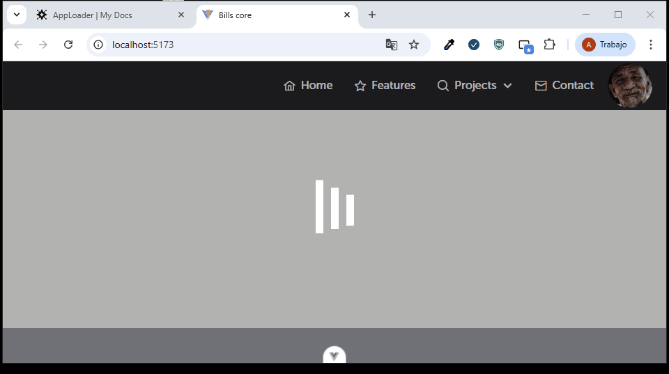

El componente loader se encuentra anclado al componente MainContent.vue dentro del dashboard, así mismo utiliza un estado del storeLoader, el cual se activara siempre y cuando este en estado true.

Este componente lo podemos activar para ejecuciones de funciones que requieren consumo de api's. Cabe aclara que el componente no expone propiedades y eventos hacia el componente padre.

Este es el ejemplo de como utilizarlo:

```
<template>
<AppLoader v-if="loader" />
</template>
<script setup lang="">
import AppLoader from "src/core/components/AppLoader.vue";
import {useLoaderStore} from "src/core/store/useLoaderStore.ts";

const {loader} = useLoaderStore();

</script>
```



