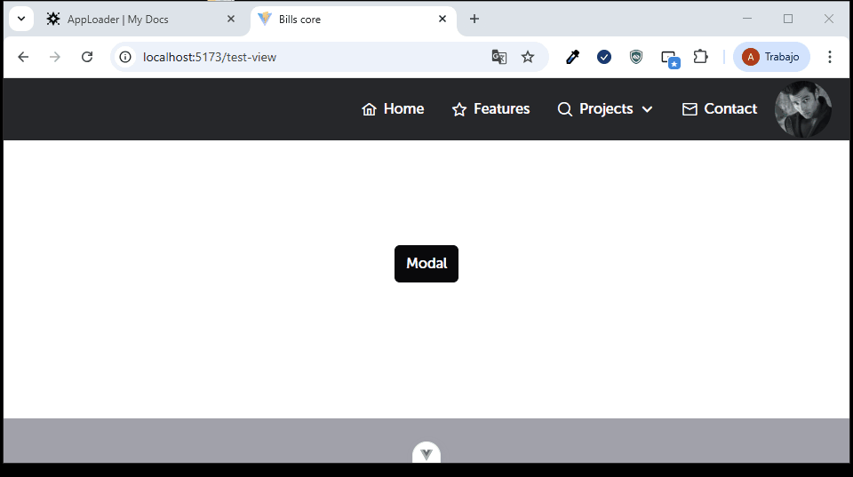

El componente modal nos permitira visualizar contenido en cards flotantes, las propiedades con las que cuenta son las siguientes:

| Propiedad       | Tipo    | Valor por defecto | Descripción                                                         |
| --------------- | ------- | ----------------- | ------------------------------------------------------------------- |
| title           | String  | ''                | Título principal que se mostrará en el componente.                  |
| show            | Boolean | false             | Controla la visibilidad del componente (mostrar u ocultar).         |
| titleBtnCancel  | String  | 'Cancel'          | Texto del botón de cancelación.                                     |
| titleBtnConfirm | String  | 'Confirm'         | Texto del botón de confirmación.                                    |
| width           | String  | '50rem'           | Ancho del componente (por ejemplo, un modal).                       |
| footerButtons   | Boolean | true              | Determina si se deben mostrar los botones en el pie del componente. |
| showIconClose   | Boolean | false             | Indica si se debe mostrar el icono de cierre en la esquina.         |

A continuación se muestra la manera en como utilizar el componente en referencia:

```
<template>
<Button @click="openModal(show)">Modal</Button>
  <AppModal
    :show="show"
    @close-modal="closeModal"
    @confirm-modal="confirmModal"
    show-icon-close
    title="AppModal"
  >
    <div>
      <h1>Aca esta el body del modal</h1>
    </div>
  </AppModal>
</template>
<script setup lang="ts">
import AppModal from "src/core/components/AppModal.vue"
import { ref } from 'vue';
import { Button } from 'primevue';

const show = ref<boolean>(false);

const openModal = (value: boolean) => {
  show.value = !value;
};

const closeModal = (value: boolean) => {
  show.value = value;
};

const confirmModal = () => {
  //TODO
  //aca debe hacer algo
  closeModal(false);
};

</script>
```
;