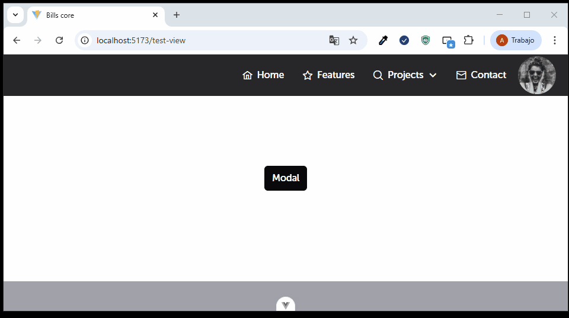

A continuación se muestra la única propiedad del menubar:

| Propiedad | Tipo        | Valor por defecto | Descripción                                                                                     |
| --------- | ----------- | ----------------- | ----------------------------------------------------------------------------------------------- |
| menu      | MenuModel[] | []                | Arreglo de ítems de menú. Cada elemento puede tener submenús anidados y opcionalmente un ícono. |


Para una mejor comprensión a continuación se muestra como esta compuesto el tipo MenuModel:

### Estructura del tipo `MenuModel`

| Propiedad | Tipo         | Requerido | Descripción                                                           |
|-----------|--------------|-----------|-----------------------------------------------------------------------|
| label     | string       | Sí        | Texto que se mostrará como título del ítem de menú.                   |
| icon      | string       | No        | Nombre del icono asociado al ítem.                                    |
| items     | SubMenu[]    | No        | Arreglo de submenús anidados bajo el ítem principal.                  |
| isUser    | boolean      | No        | Indica si el ítem está relacionado con un usuario (por ejemplo, perfil). |

### Estructura del tipo `SubMenu`

| Propiedad | Tipo         | Requerido | Descripción                                                   |
|-----------|--------------|-----------|---------------------------------------------------------------|
| label     | string       | Sí        | Texto que se mostrará como título del submenú.                |
| icon      | string       | No        | Nombre del icono asociado al submenú.                         |
| items     | SubMenu[]    | No        | Submenús anidados (puede ser recursivo).                      |

Cabe mencionar que actualmente este componente se encuentra acoplado al componente global AppHeader.vue, pero igualmente se puede utilizar de esta manera.


```
<template>
    <div
      class="w-full h-full bg-transparent flex justify-start items-center align-baseline"
    >
      <AppNavBarMenu
        class="flex justify-end align-baseline content-center"
        :menu="items"
      />
    </div>
</template>
<script setup lang="ts">
import { Button } from 'primevue';
import { ref } from 'vue';
import AppNavBarMenu from './AppNavBarMenu.vue';
import type { Menu } from '../interfaces/menu.navbar.interface';

defineOptions({ name: 'AppHeader' });

const items = ref<Menu[]>([
  {
    label: 'Projects',
    isUser: true,
    items: [
      {
        label: 'User',
        icon: 'pi pi-user',
      },
      {
        label: 'Email',
        icon: 'pi pi-envelope',
      },
      {
        label: 'Log out',
        icon: 'pi pi-sign-out',
      },
    ],
  },
  {
    label: 'Home',
    icon: 'pi pi-home',
  },
  {
    label: 'Features',
    icon: 'pi pi-star',
  },
  {
    label: 'Projects',
    icon: 'pi pi-search',
    items: [
      {
        label: 'Components',
        icon: 'pi pi-bolt',
      },
      {
        label: 'Blocks',
        icon: 'pi pi-server',
      },
      {
        label: 'UI Kit',
        icon: 'pi pi-pencil',
      },
      {
        label: 'Templates',
        icon: 'pi pi-palette',
        items: [
          {
            label: 'Apollo',
            icon: 'pi pi-palette',
          },
          {
            label: 'Ultima',
            icon: 'pi pi-palette',
          },
        ],
      },
    ],
  },
  {
    label: 'Contact',
    icon: 'pi pi-envelope',
  },
]);
</script>
<style scoped></style>

```


